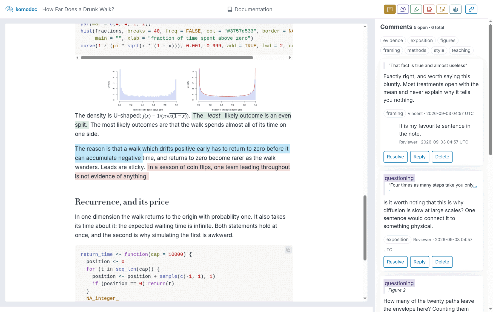

# Komodoc

Publish an HTML or Markdown document, share its unlisted link, and collect
comments and highlights in real time.

- Highlight passages, suggest edits, and comment on figures
- Multiple people can annotate simultaneously, with live updates
- Publish and manage documents from the web or CLI
- Trivial to deploy: host locally with the bundled server, or on Cloudflare
  Workers and R2
- Free public sandbox for small, short-lived notebooks
- Allow anonymous comments or require GitHub authentication
- Export annotations as Markdown or W3C JSON-LD



## Install

```sh
curl -fsSL https://raw.githubusercontent.com/vincentarelbundock/komodoc/main/install.sh | sh
```

The installer supports Linux and macOS. Windows binaries are available on the
[releases page](https://github.com/vincentarelbundock/komodoc/releases).

## Try it now

The Komodoc maintainers host a free sandbox, where anyone can upload small (<4MB) short-lived (<24hrs) HTML or Markdown files. To upload a document, you will need to log into the Komodoc management console using your Github username:

- [Komodoc console](https://komodoc.vincentarelbundock.workers.dev)

If you do not want to log in but want to try annotating some documents, you can try one of these live examples:

- [HTML: A Short Style Guide for Quantitative Writing](https://komodoc.vincentarelbundock.workers.dev/docs/html-a-short-style-guide-for-quantitative-writing)
- [Markdown: What a Regression Table Is Hiding](https://komodoc.vincentarelbundock.workers.dev/docs/markdown-what-a-regression-table-is-hiding)
- [Quarto: What the Bootstrap Actually Resamples](https://komodoc.vincentarelbundock.workers.dev/docs/quarto-what-the-bootstrap-actually-resamples)
- [Calepin: Newton's Method Is Not Always Your Friend](https://komodoc.vincentarelbundock.workers.dev/docs/calepin-newton-s-method-is-not-always-your-friend)
- [Jupyter: Simpson's Paradox Is Not a Paradox](https://komodoc.vincentarelbundock.workers.dev/docs/jupyter-simpson-s-paradox-is-not-a-paradox)
- [Marimo: How Far Does a Drunk Walk?](https://komodoc.vincentarelbundock.workers.dev/docs/marimo-how-far-does-a-drunk-walk)
- [Publication and management console](https://komodoc.vincentarelbundock.workers.dev) (requires Github Login)

## Publish

A hosted Komodoc service is called an *endpoint*. You can use the sandbox
endpoint or [deploy your own](#deploy), at a URL such as
`https://my-docs.YOUR-SUBDOMAIN.workers.dev`. Everything you publish, and every
comment left on it, belongs to that endpoint and to nobody else.

### Web

Open the endpoint in a browser, sign in with GitHub, and upload an `.html` or
`.md` file. Send the resulting link to your readers.

### CLI

Sign in once, then publish. Both commands need to know the endpoint:

```sh
komodoc login --endpoint https://my-docs.YOUR-SUBDOMAIN.workers.dev
komodoc publish paper.html --title "My Paper" \
  --endpoint https://my-docs.YOUR-SUBDOMAIN.workers.dev
```

Set `KOMODOC_ENDPOINT` to skip the flag:

```sh
export KOMODOC_ENDPOINT=https://my-docs.YOUR-SUBDOMAIN.workers.dev
komodoc publish paper.html --title "My Paper"
```

Documents are unlisted, not private: anyone with the link can read them. HTML
files must be self-contained, with images, styles, and fonts embedded. For
Quarto, render with:

```sh
quarto render paper.qmd --to html -M embed-resources:true
```

## Comment

Visit the URL you were given. Select any passage to highlight it or attach a
comment; comments appear immediately for everyone else reading the document.

Depending on the publisher's settings, you may be asked to sign in with GitHub
first. Only publicly available information is collected: your GitHub username.

## Deploy

Komodoc can run locally for a quick trial, as a self-managed server on your
own host, or on Cloudflare Workers and R2.

### Local

Run a public local instance without Cloudflare or GitHub setup:

```sh
komodoc serve --port 8081 --publishers anyone --expire-after 24h
```

Open <http://localhost:8081>. Documents and comments are stored in
`komodoc-data`; back up that directory if you use the local instance for real
work. When expiry is enabled, the server cleans up at startup and hourly while
it is running.

### Self-managed server

Run the bundled server on your own host. Set `--data` to a persistent directory
and choose who may publish or comment:

```sh
komodoc serve --port 8080 --data /var/lib/komodoc \
  --publishers YOUR-GITHUB-LOGIN --commenters anyone
```

For GitHub sign-in, set `KOMODOC_GITHUB_CLIENT_ID` and
`KOMODOC_GITHUB_CLIENT_SECRET`, and configure the OAuth callback URL for the
server's public HTTPS address. Put the server behind a TLS reverse proxy in
production.

### Cloudflare

Komodoc can also run on Cloudflare Workers and R2. Before deploying:

Cloudflare R2 includes 10 GB of storage per month for free and does not charge
egress fees. You may be charged if your storage exceeds 10 GB; see
[R2 pricing](https://developers.cloudflare.com/r2/pricing/).

1. In the Cloudflare dashboard, enable R2 and choose a `workers.dev` subdomain.
2. Create a [Cloudflare API token](https://dash.cloudflare.com/profile/api-tokens)
   with `Workers Scripts: Edit`, `Workers R2 Storage: Edit`, and
   `Account Settings: Read` permissions.
3. Create a [GitHub OAuth app](https://github.com/settings/developers), with
   Device Flow enabled. For a deployment labelled `my-docs`, use these URLs:

   ```text
   Homepage URL:               https://my-docs.YOUR-SUBDOMAIN.workers.dev
   Authorization callback URL: https://my-docs.YOUR-SUBDOMAIN.workers.dev/auth/callback
   ```

Deploy it:

```sh
export CLOUDFLARE_API_TOKEN="..."
export KOMODOC_GITHUB_CLIENT_ID="..."
export KOMODOC_GITHUB_CLIENT_SECRET="..."

komodoc deploy --label my-docs --publishers YOUR-GITHUB-LOGIN
```

The label is the first part of the URL, so this endpoint is
`https://my-docs.YOUR-SUBDOMAIN.workers.dev`.

To delete documents automatically after their most recent publication:

```sh
komodoc deploy --label my-docs --expire-after 24h
```

Use `--expire-from created` for a fixed lifetime from the first upload, or
`--expire-after never` to disable expiry. Cloudflare runs the cleanup schedule;
the `komodoc` program does not need to remain running.

## Export comments

Find the document slug with `komodoc list`, then export readable Markdown:

```sh
komodoc list --endpoint https://my-docs.YOUR-SUBDOMAIN.workers.dev
komodoc export DOCUMENT-SLUG --format markdown --out comments.md \
  --endpoint https://my-docs.YOUR-SUBDOMAIN.workers.dev
```

Without `--format markdown`, Komodoc exports W3C Web Annotation JSON-LD.

Run `komodoc` to see all commands and options, including access controls,
deleting documents, and removing a deployment.

## Environment variables

Flags take precedence over their corresponding environment variables.

| Variable | Purpose |
| --- | --- |
| `CLOUDFLARE_API_TOKEN` | Cloudflare credentials for deploying or removing a service |
| `CLOUDFLARE_ACCOUNT_ID` | Cloudflare account to use when the token can access more than one |
| `KOMODOC_ENDPOINT` | Default endpoint for `login`, `publish`, `list`, `export`, and document deletion |
| `KOMODOC_TOKEN` | GitHub token to use instead of `komodoc login` |
| `KOMODOC_LABEL` | Default deployment label |
| `KOMODOC_GITHUB_CLIENT_ID` | GitHub OAuth app client ID |
| `KOMODOC_GITHUB_CLIENT_SECRET` | GitHub OAuth app client secret |
| `KOMODOC_PUBLISHERS` | GitHub accounts allowed to publish |
| `KOMODOC_COMMENTERS` | Who may comment: `anyone`, `any`, or a list of GitHub accounts |
| `KOMODOC_EXPIRE_AFTER` | Automatically delete documents after a duration such as `24h` or `30d` |
| `KOMODOC_EXPIRE_FROM` | Start retention at `updated` (default) or `created` |
| `KOMODOC_VERSION` | Version selected by the installer |
| `KOMODOC_BIN_DIR` | Installation directory selected by the installer |
