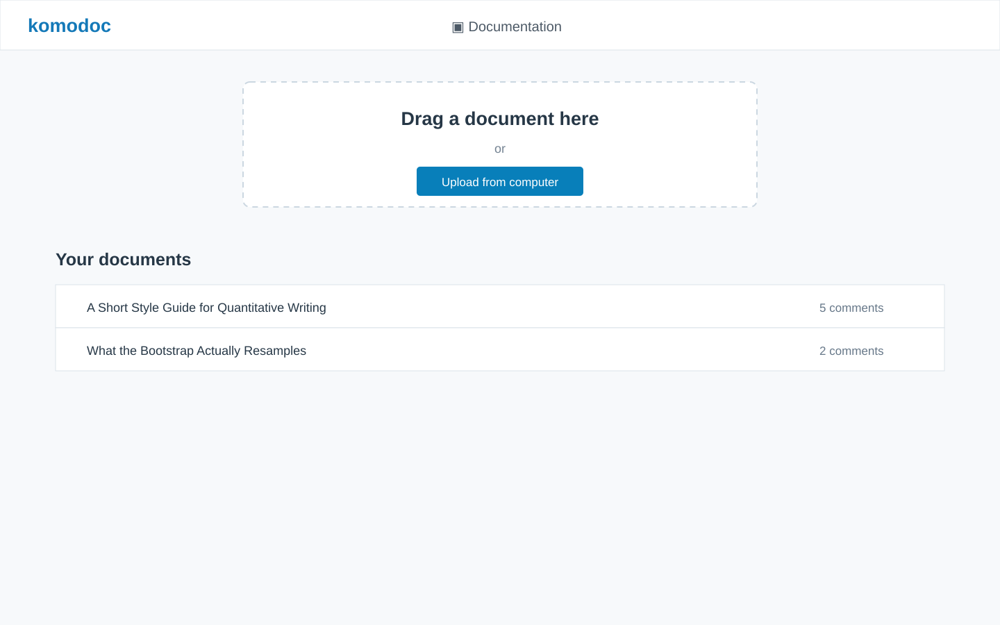

# Komodoc

Publish an HTML or Markdown document, share its unlisted link, and collect
comments and highlights in real time.

- Highlight passages, suggest edits, and comment on figures
- Multiple people can annotate simultaneously, with live updates
- Publish and manage documents from the web or CLI
- Trivial to deploy: host locally with the bundled server, or on Cloudflare
  Workers and R2
- Free public sandbox for small, short-lived notebooks
- Allow anonymous comments or require GitHub authentication
- Export annotations as Markdown or W3C JSON-LD


## Install

```sh
curl -fsSL https://raw.githubusercontent.com/vincentarelbundock/komodoc/main/install.sh | sh
```

The installer supports Linux and macOS. Windows binaries are available on the
[releases page](https://github.com/vincentarelbundock/komodoc/releases).

## Web interface: Try it now!

The Komodoc sandbox is a free website where anyone can upload small (<4MB) short-lived (<24hrs) HTML or Markdown files. To upload a document, you will need to log with your Github username:

[Komodoc sandbox](https://komodoc.vincentarelbundock.workers.dev)

If you do not want to log in but want to try annotating some documents, you can try one of these live examples:

- [HTML: A Short Style Guide for Quantitative Writing](https://komodoc.vincentarelbundock.workers.dev/docs/html-a-short-style-guide-for-quantitative-writing)
- [Markdown: What a Regression Table Is Hiding](https://komodoc.vincentarelbundock.workers.dev/docs/markdown-what-a-regression-table-is-hiding)
- [Quarto: What the Bootstrap Actually Resamples](https://komodoc.vincentarelbundock.workers.dev/docs/quarto-what-the-bootstrap-actually-resamples)
- [Calepin: Newton's Method Is Not Always Your Friend](https://komodoc.vincentarelbundock.workers.dev/docs/calepin-newton-s-method-is-not-always-your-friend)
- [Jupyter: Simpson's Paradox Is Not a Paradox](https://komodoc.vincentarelbundock.workers.dev/docs/jupyter-simpson-s-paradox-is-not-a-paradox)
- [Marimo: How Far Does a Drunk Walk?](https://komodoc.vincentarelbundock.workers.dev/docs/marimo-how-far-does-a-drunk-walk)
- [Publication and management console](https://komodoc.vincentarelbundock.workers.dev) (requires Github Login)

<aside class="callout warning">
<strong>Warning:</strong> Do not publish confidential information on the Komodoc sandbox. Normally, documents are only visible to the person who uploaded them, or to people with the randomly generated and unlisted link. But if you are gathering comments on documents about national security, you should probably <a href="#self-managed-server">host your own instance</a> or find another solution.
</aside>

A hosted Komodoc service is called an *endpoint*. You can use the sandbox
endpoint or [deploy your own](#deploy), at a URL such as
`https://komodoc.vincentarelbundock.workers.dev`. Everything you publish, and every
comment left on it, belongs to that endpoint and to nobody else.

Open the endpoint in a browser, sign in with GitHub, and upload an `.html` or
`.md` file. Send the resulting unlisted link to your readers; anyone with the
link can read the document.

The management interface lists the documents you own and any reserved examples.
It does not reveal documents owned by other publishers. Documents without a
recorded owner (for example, older documents created before ownership was
enabled) remain shared and visible to every publisher.

Select any passage to highlight it or attach a comment; comments appear
immediately for everyone else reading the document. Depending on the
publisher's settings, readers may be asked to sign in with GitHub first. Only
publicly available information is collected: your GitHub username.[^github-data]

<div class="screenshot-pair">
<figure>

<figcaption>The free sandbox landing page.</figcaption>
</figure>
<figure>

<figcaption>The annotation window, with highlights and threaded comments.</figcaption>
</figure>
</div>

## CLI

The command-line client uses the endpoint URL you provide, or
[`KOMODOC_ENDPOINT`](#environment-variables) from the environment. The
environment variable is convenient for a shell session, but the examples below
keep the endpoint explicit so each command can be copied and understood on its
own.

### Authenticate

Sign in once with GitHub using the device flow:

```sh
komodoc login --endpoint https://komodoc.vincentarelbundock.workers.dev
```

### Publish

Publish an HTML or Markdown document:

```sh
komodoc publish paper.html --title "My Paper" \
  --endpoint https://komodoc.vincentarelbundock.workers.dev
```

HTML files must be self-contained, with images, styles, and fonts embedded. For
Quarto, render with:

```sh
quarto render paper.qmd --to html -M embed-resources:true
```

### List

List the documents visible to your account. Each row shows the shortest prefix
that uniquely identifies the document, its date, and its title:

```sh
komodoc list --endpoint https://komodoc.vincentarelbundock.workers.dev
```

### Comment

Open a listed document in your browser for commenting. The ID can be the short
prefix printed by `list` (or the full slug):

```sh
komodoc comment af3ha --endpoint https://komodoc.vincentarelbundock.workers.dev
```

### Export

Export annotations as readable Markdown:

```sh
komodoc export DOCUMENT-SLUG --format markdown --out comments.md \
  --endpoint https://komodoc.vincentarelbundock.workers.dev
```

Without `--format markdown`, Komodoc exports W3C Web Annotation JSON-LD.

### Destroy

Delete one document, including its history and comments. The command asks for
confirmation unless `--yes` is supplied:

```sh
komodoc destroy --document DOCUMENT-SLUG \
  --endpoint https://komodoc.vincentarelbundock.workers.dev
```

To remove an entire Cloudflare deployment instead, use
`komodoc destroy --service --label my-docs`.

## Deploy

Komodoc can run locally for a quick trial, as a self-managed server on your
own host, or on Cloudflare Workers and R2.

### Local

Run a public local instance without Cloudflare or GitHub setup:

```sh
komodoc serve --port 8081 --publishers anyone --expire-after 24h
```

Open <http://localhost:8081>. Documents and comments are stored in
`komodoc-data`; back up that directory if you use the local instance for real
work. When expiry is enabled, the server cleans up at startup and hourly while
it is running.

### Self-managed server

Run the bundled server on your own host. Set `--data` to a persistent directory
and choose who may publish or comment:

```sh
komodoc serve --port 8080 --data /var/lib/komodoc \
  --publishers YOUR-GITHUB-LOGIN --commenters anyone
```

For GitHub sign-in, set `KOMODOC_GITHUB_CLIENT_ID` and
`KOMODOC_GITHUB_CLIENT_SECRET`, and configure the OAuth callback URL for the
server's public HTTPS address. Put the server behind a TLS reverse proxy in
production.

### Retention

Delete documents automatically after their most recent publication:

```sh
komodoc serve --expire-after 24h
```

For a fixed lifetime from the first upload, use `--expire-from created`. Use
`--expire-after never` to disable expiry. The same options apply to Cloudflare
deployments:

```sh
komodoc deploy --label my-docs --expire-after 24h
```

### Cloudflare

Komodoc can also run on Cloudflare Workers and R2. Before deploying:

Cloudflare R2 includes 10 GB of storage per month for free and does not charge
egress fees. You may be charged if your storage exceeds 10 GB; see
[R2 pricing](https://developers.cloudflare.com/r2/pricing/).

1. In the Cloudflare dashboard, enable R2 and choose a `workers.dev` subdomain.
2. Create a [Cloudflare API token](https://dash.cloudflare.com/profile/api-tokens)
   with `Workers Scripts: Edit`, `Workers R2 Storage: Edit`, and
   `Account Settings: Read` permissions.
3. Create a [GitHub OAuth app](https://github.com/settings/developers), with
   Device Flow enabled. For a deployment labelled `my-docs`, use these URLs:

   ```text
   Homepage URL:               https://my-docs.YOUR-SUBDOMAIN.workers.dev
   Authorization callback URL: https://my-docs.YOUR-SUBDOMAIN.workers.dev/auth/callback
   ```

Deploy it:

```sh
export CLOUDFLARE_API_TOKEN="..."
export KOMODOC_GITHUB_CLIENT_ID="..."
export KOMODOC_GITHUB_CLIENT_SECRET="..."

komodoc deploy --label my-docs --publishers YOUR-GITHUB-LOGIN
```

The label is the first part of the URL, so this endpoint is
`https://my-docs.YOUR-SUBDOMAIN.workers.dev`. Cloudflare runs the cleanup
schedule; the `komodoc` program does not need to remain running.

Three flags bound what a deployment will store, and all three apply to
`komodoc serve` as well: `--max-size` caps one document (4 MB by default),
`--quota` caps what one publisher may hold across all their documents (100 MB),
and `--storage` caps the whole deployment (5120 MB). Each publisher may also
hold at most 50 documents and upload at most 30 times an hour.

## Environment variables

[^github-data]: Komodoc requests no GitHub scopes through OAuth. It uses the
GitHub API only to obtain your public login name; it does not collect your email,
repositories, or other profile data.

Flags take precedence over their corresponding environment variables.

| Variable | Purpose |
| --- | --- |
| `CLOUDFLARE_API_TOKEN` | Cloudflare credentials for deploying or removing a service |
| `CLOUDFLARE_ACCOUNT_ID` | Cloudflare account to use when the token can access more than one |
| `KOMODOC_ENDPOINT` | Default endpoint for `login`, `publish`, `list`, `export`, and document deletion |
| `KOMODOC_TOKEN` | GitHub token to use instead of `komodoc login` |
| `KOMODOC_LABEL` | Default deployment label |
| `KOMODOC_GITHUB_CLIENT_ID` | GitHub OAuth app client ID |
| `KOMODOC_GITHUB_CLIENT_SECRET` | GitHub OAuth app client secret |
| `KOMODOC_PUBLISHERS` | GitHub accounts allowed to publish |
| `KOMODOC_COMMENTERS` | Who may comment: `anyone`, `any`, or a list of GitHub accounts |
| `KOMODOC_EXPIRE_AFTER` | Automatically delete documents after a duration such as `24h` or `30d` |
| `KOMODOC_EXPIRE_FROM` | Start retention at `updated` (default) or `created` |
| `KOMODOC_VERSION` | Version selected by the installer |
| `KOMODOC_BIN_DIR` | Installation directory selected by the installer |
