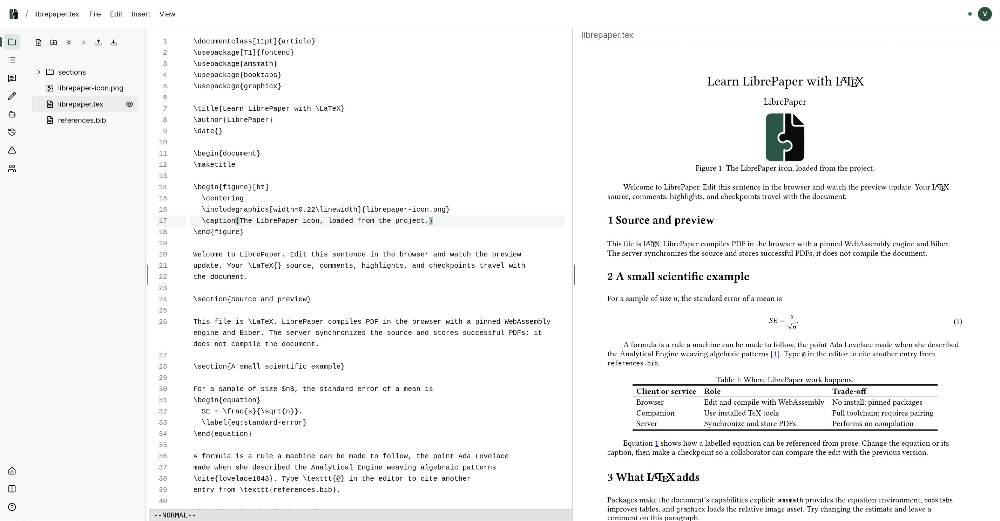

# LibrePaper

Create or upload an HTML, Markdown, Typst, LaTeX or Quarto project in the
browser, share a link to it, and collect comments and highlights in real time.

- Highlight passages, suggest edits, and comment on the text
- Multiple people can annotate simultaneously, with live updates
- Create, edit, review, share, and render projects in the browser
- Trivial to deploy: one static binary, on your laptop or on a small server
- Export a complete, independent project copy from the CLI



## Try it

[Sign in](https://app.librepaper.org) with GitHub or Google and your account
starts with five tutorials, the same walkthrough in Markdown, Typst, HTML, LaTeX
and Quarto. Open one and drag across a sentence: a comment box opens where you
released.

## Install

Follow the [install page](https://librepaper.org/install.html): installer scripts, Homebrew and Scoop.

## Documentation

The manual lives at **[librepaper.org](https://librepaper.org)**: notebooks,
sharing and review, agents, the CLI, and self-hosting.
Its source is in [`docs/`](docs/), and `make site` builds it.

The ordinary CLI covers `login`, `logout`, `list`, and one-shot `export`.
The root commands operate the companion on your computer, `admin` operates a
deployment, and `mcp` serves a document's tools to an agent.

LibrePaper Companion can also keep scheduled ZIP copies of every project
available to your signed-in account, including shared projects. See the
[local backups guide](docs/backups.md).

```sh
librepaper export DOCUMENT ./paper-copy
```

An exported project is a snapshot copy. Editing it does not update the hosted
document.

- [What is LibrePaper](https://librepaper.org/what.html)
- [Install](https://librepaper.org/install.html)
- [Self-hosting](https://librepaper.org/host/simple.html)
- [Privacy](https://librepaper.org/privacy.html)
- [Building from source](https://librepaper.org/architecture/building.html)

## Credits

The typewriter photograph on the landing page is by [Annie Spratt](https://pixabay.com/users/anniespratt-5063125/), from [Pixabay](https://pixabay.com/photos/vintage-typewriter-2168174/).

## License

LibrePaper is distributed under the [MIT License](LICENSE).
