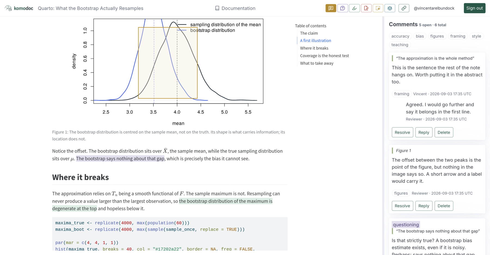

# LibrePaper

Create or upload an HTML, Markdown, Typst, LaTeX or Quarto project in the
browser, share a link to it, and collect comments and highlights in real time.

- Highlight passages, suggest edits, and comment on the text
- Multiple people can annotate simultaneously, with live updates
- Create, edit, review, share, and render projects in the browser
- Trivial to deploy: one static binary, on your laptop or on a small server
- Export a complete, independent project copy from the CLI



## Try it

[Sign in](https://app.librepaper.org) with GitHub or Google and your account
starts with five tutorials, the same walkthrough in Markdown, Typst, HTML, LaTeX
and Quarto. Open one and drag across a sentence: a comment box opens where you
released.

## Install

Follow the [install page](https://librepaper.org/install.html): installer scripts, Homebrew, Scoop and Cargo.

## Documentation

The manual lives at **[librepaper.org](https://librepaper.org)** -- authoring
in each format, sharing and review, the CLI, and running a server of your own.
Its source is in [`docs/`](docs/), and `make site` builds it.

The ordinary CLI covers `login`, `logout`, `list`, and one-shot `export`.
The root commands operate the companion on your computer, `admin` operates a
deployment, and `mcp` serves a document's tools to an agent.

LibrePaper Companion can also keep scheduled ZIP copies of every project
available to your signed-in account, including shared projects. See the
[local backups guide](docs/backups.md).

```sh
librepaper export DOCUMENT ./paper-copy
```

An exported project is a snapshot copy. Editing it does not update the hosted
document.

Browsers fetch the WebAssembly renderers (`wasm/<sha256>/`) and the LaTeX
engines from an asset mirror, an S3 bucket on OVH by default. `assets.lock`
pins each wasm module by digest and the LaTeX release directory,
`latex/<sha256>/`, by its id, and the binary carries the pins. Everything on
the mirror is immutable and the mirror only grows, so older binaries keep
working. Operators can host their own copy with `--asset-mirror`.
See [`docs/asset-mirrors.md`](docs/dev/asset-mirrors.md).

- [What is LibrePaper](https://librepaper.org/what.html)
- [Install](https://librepaper.org/install.html)
- [Self-hosting](https://librepaper.org/host.html)
- [Privacy and the LaTeX mirror](https://librepaper.org/host.html#privacy)
- [Building from source](https://librepaper.org/architecture/building.html)

## Credits

The typewriter photograph on the landing page is by [Annie Spratt](https://pixabay.com/users/anniespratt-5063125/), from [Pixabay](https://pixabay.com/photos/vintage-typewriter-2168174/).

## License

LibrePaper is distributed under the [MIT License](LICENSE).
