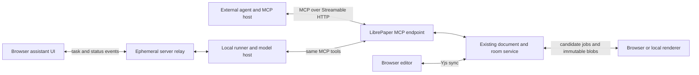

# Agent document protocol redesign

Status: core protocol implemented and reviewed on 2026-09-11. The design below remains the target contract; the implementation notes distinguish shipped mechanisms from later rollout criteria. Backward compatibility is explicitly out of scope.

## Implementation notes

The implementation adds a document-scoped MCP endpoint, the five schema-validated tools, immutable compressed views and candidates, signed passage handles, bounded query results, atomic annotation batches, conditional multi-file source transactions, durable receipts, cancellation, and candidate rendering through the browser. The sidebar runner uses the same tools through a persistent stdio adapter, records operation identities before dispatch, and derives suggestion results from confirmed receipts. The checked-in tool schemas at `crates/librepaper/src/server/mcp/tools.json` define the exact accepted wire fields.

Operational choices for this implementation:

- Remote transport targets MCP `2026-07-28`. The stdio adapter also translates the initialization exchange used by older installed hosts; this is a host integration detail, not a second document API. It projects each successful result once. Remote control messages are bounded at 64 KiB; legacy stdio output allows 128 KiB for the extra JSON string escaping while preserving the original structured-result budget.
- Views, private candidates, and admission epochs expire after at most one hour. Terminal operation receipts are retained for seven days; prepared operations and cancellation flags protecting them remain until reconciled. Expired receipt absence means `outcome_unknown`, never proof that an effect did not occur. Admission quotas preserve capacity for reading retained results. Authorization is checked again when retained data is delivered and when effects commit.
- `unchanged_dependencies` conservatively requires the complete captured hash of each target/dependency file. Edits to other files can proceed; edits elsewhere in a dependency file require a fresh view. Range text alone cannot safely distinguish shifted duplicate passages or empty insertions.
- Source writes use a durable intent, a pre-effect backup, and an authenticated marker written in the same Yjs transaction as the patch. A receipt follows durable source storage; recovery reconciles the intent before serving the room. Annotation effects and their receipts share one SQLite transaction.
- Query work is bounded by document size, eight queries per call, response budgets, and server admission limits. Immutable revision indexes cache structural offsets and repeated literal searches. Compression and query execution run outside asynchronous I/O workers. Separate request capacity protects cancellation while render calls wait.
- Sidebar runners receive a server-owned execution epoch on socket admission. A 60-second catalog lease is renewed every ten seconds and fenced on replacement or disconnect. Source recovery retains the original epoch; a replacement runner cannot authorize an interrupted old effect. External MCP clients use their authenticated document authority without requiring a sidebar connection.
- Renderer jobs carry candidate references through chat and retrieve source through authenticated HTTP. A browser is required for the implemented compile path; unavailable rendering produces an explicit recoverable result. MCP Tasks are not advertised; `document_result` is the ordinary-tool recovery path.
- `changes` queries compare against a retained prior view ID supplied in `revision`. Diagnostic/render queries take a candidate ID in `id` and can require its source hash in `revision`. Render metadata is not a complete rendered-text or visual-artifact extraction API.

The later rollout criteria remain explicit: provider-billed task/quality benchmarks, two independent production MCP-host validations, adaptive whole-project retrieval, selective visual artifacts, MCP Tasks support, and multiple observing browser tabs. Existing convenience CLI and preview paths remain available during cutover. Do not interpret this implementation as evidence that those later criteria have passed.

The local transfer fixture (`mcp_protocol_transfer_benchmark`) compares one focused read against the existing snapshot response. On a 168,029-byte source, the measured responses were 344,801 versus 1,462 JSON bytes (99.6% fewer bytes). The cold MCP read was 14.6 ms, versus 12.8 ms for a snapshot; repeated immutable-view reads had a 4.2 ms median over 20 samples. These are uncompressed local payload/latency measurements, not provider token counts, billing savings, or a production latency guarantee.

Review validation covers multi-file atomicity, lost-response replay, checkpoint/receipt rollback, cancellation races, revoked runner recovery, bounded Unicode pagination, and candidate rendering through authenticated HTTP. The integrated full Rust run had 1,121 passes, 28 ignored tests, and one Calepin file-watcher timeout; the same timeout reproduced on untouched main, and the protocol branch passed that test in isolation. Three short checkpoint-test setup timeouts seen at higher test parallelism passed both individually and in the lower-parallelism full run.

## 1. Decision

Use MCP as the primary agent interface, implemented inside the existing LibrePaper server. Agents connect directly to its document tools. Give the model bounded source views and handles to exact passages; accept patches against those handles. Let the document service manage revisions, candidate construction, rendering, and durable receipts. Let the MCP host manage credentials and transport.

This specification defines LibrePaper's tool semantics and efficiency guarantees on top of MCP. It does not introduce a parallel agent RPC protocol or require a local broker. Keep the existing local runner for browser chat and local execution/rendering. An optional local MCP adapter can serve hosts that need stdio or local credential integration, using the same tools and server operations.

The central optimization is to reduce the number of decisions and bytes that must pass through the model. A faster serialization format cannot compensate for repeatedly asking the model to discover a CLI, reconstruct anchors, regenerate entire files, or investigate uncertain writes.

Keep the server authoritative for shared document state and permissions. Keep the runner authoritative for local model execution and conversation history. Keep renderers responsible for producing revision-bound evidence. Keep Yjs as the collaborative editing mechanism inside the document service and browser; an LLM tool client should not need to become a CRDT replica.

## 2. What the current implementation teaches us

This is an architectural review, not a claim that every limitation below is a correctness defect. Observations come from code and tests; performance effects are hypotheses until benchmarked.

| Priority | Observed implementation | Consequence and proposed improvement |
| --- | --- | --- |
| P0 | `cli/assistant_tools.rs::inspect` calls `peer.snapshot()` before filtering files, headings, sections, search, bibliography, or a thread. | Focused output still requires a full source-and-comment download. Execute bounded queries at the authoritative service and reuse cached immutable results. |
| P0 | `server/documents.rs::handle_snapshot` emits the main source both as `source` and inside `texts`, and file metadata both as `files` and inside `tree`. | Full reads duplicate content and metadata. Separate manifest, source views, annotations, and assets; include each requested body once. |
| P0 | `cli/peer.rs::AutomationPeer::open` performs a document metadata request; normal CLI invocations create a new peer. The runner instructs the model to use shell commands and help/skill discovery. | Repeated commands add process, connection, metadata, and discovery work. Expose compact MCP tools and reuse transport connections without per-command process startup. |
| P0 | `cli/runner_preview.rs` fetches another snapshot and sends complete replacement text for existing files, limited to 16 KiB in aggregate. The CLI polls result files every 100 ms; the runner scans for requests on a 250 ms tick. | A tiny edit in a large file can exceed the preview limit. Send a candidate reference, retrieve missing blobs outside chat, and replace file polling with renderer jobs. |
| P0 | `server/assistant.rs::BatchRequest` has a revision and items but no durable batch operation key. `room/comments.rs::apply_suggestion_batch` creates new pass and comment IDs and permits partial results. | A lost batch response needs manual investigation; repeating the batch can create new proposals. Introduce durable operation receipts and explicit atomic versus independent batching. |
| P1 | `cli/peer.rs::edit_source_at` takes a full replacement, fetches a snapshot, opens a room socket, synchronizes Yjs, diffs locally, and waits for persistence. | Correctness and transport machinery are paid for by each direct edit. Send a small conditional edit transaction to the room owner instead. Preserve collaboration semantics and explicitly define conflict behavior. |
| P1 | `web/src/lib/assistant.js` attaches selection, thread, and available diagnostics within one 16 KiB context budget. | Unrelated diagnostics consume context; important data can be omitted. Store attachment references and materialize task-relevant context under a separate model budget. |
| P1 | `web/src/lib/agent-client.js` distinguishes relay ACK from runner admission, persists uncertain deliveries, and resends them. `server/chat.rs` is a live relay, not a durable task queue. | Useful reliability work is spread across both peers. Make admission and resumable task state explicit and keep transport ACKs out of product state. |
| P1 | `cli/runner.rs::State::load` marks interrupted nonterminal tasks failed; state retention is bounded and uses whole-file write/rename. | Safe refusal to replay is preferable to duplicate execution, but recovery requires user investigation and repeated model work. Journal tool effects and reconcile receipts before deciding recovery. |
| P1 | `cli/assistant_tools.rs` bounds sections by line count, uses simple heading recognition, and returns whole bibliography bodies. | A few very long lines or a large bibliography defeat the intended bound. Introduce byte/token budgets, pagination, and revision-keyed structural indexes. |
| P2 | Capabilities have multiple shapes: snapshot `read/comment/edit`, CLI `can_*`, and separate browser normalization. | Normalize one schema and keep transport feature support distinct from authorization. |

Paths in this table are relative to `crates/librepaper/src/` unless prefixed with `web/`.

Preserve the existing strengths:

- One room-locked source/tree/comment snapshot avoids internally mixed reads.
- Link-bounded authority does not borrow privileges from an owner's ambient session.
- Source anchors distinguish duplicate occurrences and retain their captured revision.
- Suggestions remain separate from source edits; refinements retain their identity.
- Preview results are checked against the candidate revision and do not mutate the document.
- The runner persists task identity and does not blindly replay interrupted model work.
- Real Yjs integration tests establish that independent concurrent edits can survive synchronization.

Relevant evidence includes [assistant protocol tests](crates/librepaper/src/tests/assistant_protocol.rs), [assistant operation tests](crates/librepaper/src/tests/assistant.rs), [CLI tests](crates/librepaper/src/tests/assistant_cli.rs), [concurrent peer tests](crates/librepaper/src/tests/agent_cli.rs), and [browser delivery checks](web/checks/agent-client.mjs). These cover useful correctness cases, but do not establish latency, token savings, or a general durable batch replay contract. No critical exploit or data-loss bug is asserted by this review. Verdict: replace the architecture incrementally through reviewable implementation stages, then cut over without a compatibility layer.

## 3. Optimize the right quantities

Approximate task latency as:

```text
critical-path model time
+ dependent tool round trips
+ uncached transfer and query work
+ required render time
+ conflict and recovery work
```

Measure model cost separately:

```text
sum(input tokens × applicable input rate
  + cached input tokens × applicable cached rate
  + output tokens × applicable output rate)
+ tool/render infrastructure cost
```

Use actual provider usage categories without double-counting cached input. Track reasoning tokens where reported. Pricing is configuration, never a protocol constant.

Optimize in this order:

1. Eliminate unnecessary model/tool turns and repeated source in model context.
2. Generate patches rather than complete replacement files.
3. Combine predictable reads and deterministic postprocessing.
4. Reuse connections, source blobs, indexes, and render artifacts.
5. Eliminate ambiguous outcomes that cause whole-task retries.
6. Tune encoding and compression only after measuring what remains.

The primary metric is cost and elapsed time per successfully completed, quality-checked user task. A cheap response that edits the wrong occurrence, misses half the paper, or requires another user turn is a regression.

## 4. Wiring and ownership



The MCP endpoint and document service run in the existing server process and dispatch to the authoritative room owner. An external agent needs no LibrePaper runner, browser conversation, or local daemon for document reads and writes. A browser or local renderer is needed only for jobs that require that execution environment. Do not introduce a vector database, message broker, or separate indexing cluster for this design.

| Component | Owns | Must not infer |
| --- | --- | --- |
| Document service | Source, annotations, revisions, operation receipts, permissions, candidate objects | User intent from source text |
| MCP endpoint | Tool schemas, bounded projections, dispatch to document operations | Durability from transport success alone |
| Agent host | Credentials, model context, client-side retries where supported | Successful writes from model prose |
| Optional local runner | Browser conversation journal, model execution, local renderer integration | Ownership of every external agent's workflow |
| Model | Interpretation, writing, explanations, choice of needed evidence | Hashes, durable outcomes, permission grants |
| Browser UI | User intent, selection capture, display, explicit review actions | Source authority from rendered DOM text |
| Renderer | Compile job, dependencies, diagnostics, output artifacts | Permission to apply its input candidate |

Use MCP's standard transport and reuse HTTP connection pools. Do not depend on connection affinity or hidden transport session state for document identity or correctness. Keep bulk artifact transfer separate from small control requests so large downloads do not delay cancellation.

The server remains free of model prompts and transcripts. Document candidates and operation receipts are document-domain objects, with explicit retention and access rules. This distinction preserves local conversation ownership without pretending that shared suggestions or candidate source can avoid server storage.

## 5. MCP contract and integration

MCP supplies discovery, tool schemas, invocation, and structured results. Use those mechanisms directly. Reuse standard transports: Streamable HTTP for remote agents and stdio for an optional local adapter. [MCP tools](https://modelcontextprotocol.io/specification/2026-07-28/server/tools), [MCP transports](https://modelcontextprotocol.io/specification/2026-07-28/basic/transports).

Target MCP revision `2026-07-28` and pin tested SDK/client versions. Its core is stateless; explicit document/view handles carry application state between calls. Do not invent a LibrePaper initialization handshake or require an MCP transport session. Verify supported features against actual hosts before release. [MCP release description](https://blog.modelcontextprotocol.io/posts/2026-07-28/).

- Publish a small, deterministically ordered `tools/list` with concise descriptions, `inputSchema`, and `outputSchema`. Generate validators and contract fixtures from the same checked-in schemas.
- Use `tools/call` and structured results. Transport/protocol errors follow MCP; document conflicts and other execution failures are tool errors carrying LibrePaper recovery data.
- Use tools for bounded, parameterized reads and mutations. Use resource links for large immutable artifacts where supported; do not require host-driven resource injection for essential source reads.
- Leave optional prompts/templates for task presets. Correctness and authorization must not depend on loading a prompt template.
- Implement each operation once in the document service. The optional stdio adapter forwards the same MCP contract; the CLI remains a convenience client, not a second agent protocol.
- Keep authenticated blob transfer as a data path. It is not a second control API, and a resource URI is not permission to read its target.

`document_read` accepts a `context` query that returns document identity, effective permissions, authorization epoch, current revision tuple, renderer availability, limits, operation epoch, and tool-schema version/digest. Combine it with the first useful source query; no separate opening call is required. Essential identity and applicable limits also accompany ordinary read results. Credentials are supplied by the host, never as model-visible tool arguments.

Version LibrePaper's tool schemas independently from MCP. Start this replacement contract at schema major `2`; incompatible future tools require an explicit schema/tool version change, not a new wire protocol. Keep descriptive field names and reject unknown input fields. Do not make the model read CRDT updates, base64 source, binary envelopes, or secrets.

MCP request IDs correlate transport attempts. They are not durable mutation keys. Every mutation has an explicit `operation` argument with a server-issued `epoch` and client-chosen `id`; use the same pair and normalized arguments on retries. A runner or capable host records these before sending. An ordinary MCP client can pass and reuse them directly without a custom host hook. Server receipts provide replay safety either way; automatic recovery without a model turn depends on client support.

MCP standardizes how a tool is called. LibrePaper must still implement bounded reads, stable ranges, conditional writes, durable receipts, and render provenance. Merely wrapping today's full-snapshot CLI commands in MCP would preserve most of their cost.

## 6. A precise document identity model

Do not use one ambiguous `revision` for source, comments, renders, and history.

| Identity | Meaning |
| --- | --- |
| `document_id` | Stable document identity, independent of title or URL |
| `source_revision` | Digest of the canonical tree: paths, stable file IDs, blob hashes, main file, render-affecting settings |
| `annotation_revision` | Durable monotonically increasing annotation sequence within the document |
| `event_cursor` | Durable document event position used for subscription replay |
| `file_id`, `file_hash` | Stable file identity and digest of exact current bytes |
| `view_id` | Immutable read result describing specific source ranges at a captured revision |
| `candidate_id` | Immutable staged tree and patch provenance |
| `render_id` | One rendering result bound to candidate and renderer inputs |
| `checkpoint_id` | Historical record identity; several checkpoints may contain identical source |

Capture a source/annotation tuple atomically for a task view. Comment changes must not invalidate source caches. A restored tree may reuse its content digest, but must not roll back event cursors or annotation sequences.

Specify canonical tree encoding in the schema package, with cross-language golden vectors. Hash raw UTF-8 source bytes; do not normalize newlines, whitespace, or Unicode. Paths are validated relative paths with no traversal, absolute paths, NULs, or duplicate normalized names. File IDs survive renames; deleted and recreated files receive new IDs.

## 7. Read operations: progressive disclosure with snapshot consistency

Expose five core tools to the model:

| Tool | Purpose |
| --- | --- |
| `document_read` | Bounded source, outline, manifest, search, bibliography, thread, changes, rendered text, or diagnostic views |
| `document_propose` | Stage patches and optionally validate/render/publish suggestions in one orchestrated call |
| `document_apply` | Apply a reviewed candidate or explicit direct edit within the task's authority |
| `document_comment` | Create/reply/refine/resolve/decide annotations with version preconditions |
| `document_result` | Retrieve operation, candidate, render, or task status and bounded artifacts; explicitly cancel a pending operation when needed |

Use discriminated input schemas, not a generic shell or arbitrary query language. Receipt lookup uses `document_result`; transport lifecycle follows MCP. Keep file operations and visual queries within the relevant tool's schema. Clients may selectively expose tools, but basic operation must work with an ordinary host that loads all five tools.

Example tool input:

```json
{
  "document_id": "paper_1",
  "queries": [
    {"kind": "source", "selection": "selection_7", "context": "paragraph"},
    {"kind": "thread", "id": "comment_9", "include": "unresolved"}
  ],
  "snapshot": "latest",
  "budget": {"max_bytes": 12000, "max_tokens": 3000}
}
```

First reads identify the document explicitly; subsequent calls can use an authorized `view_id` that identifies the document and captured tuple. A query group shares one tuple; it must not read each member at a different live revision. `snapshot: "latest"` captures a new view; `snapshot: {"view_id": "view_12"}` reads from the existing view. New reads never silently advance an older view. An explicit historical read never silently falls back to current source. Browser conversation/task identity is optional provenance, not a prerequisite for external agents.

Query behavior:

- Source: exact ranges, headings, paragraph neighborhoods, or a whole small file. Preserve exact bytes, including final newlines. Separate display line labels from source content.
- Search: multiple literal queries, file filters, stable ordering, deduplicated neighborhoods, and pagination. Start with lexical search; add structural citation/label lookup where parsing is reliable.
- Outline: revision-keyed parsed structure with node handles and bounded excerpts. Expose parser/version and `partial` or `unsupported` status. Macro-generated LaTeX structure must not be presented as completely parsed.
- Threads: fetch one thread or filtered summaries, with annotation versions. Replies paginate independently of source.
- Bibliography: query keys, author/title metadata, duplicates, and cited/missing keys. Return raw entries only when needed. Metadata is not evidence of the cited work's claims.
- Changes: bounded changes between immutable revisions, with explicit create/delete/rename records and continuation cursors.
- Rendered text: label extraction provenance, source revision, page/region, and uncertain source mappings. Never make rendered character offsets stand in for source offsets.

Every read includes `complete`, `truncation_reason`, `next_cursor`, captured identities, and returned byte counts. Exact tokenizer counts are used when available; otherwise token counts are labeled estimates and a hard byte limit still applies. Reserve space for the envelope before filling results. A source chunk split at a UTF-8 boundary gets its own range handle and is marked partial.

Budgets must bound execution as well as response size: query count, files scanned, bytes scanned, elapsed work, and concurrent requests. Pagination cursors bind the query, immutable revision, and access scope. A cursor cannot restart a costly unbounded scan on each page; cache bounded scan state or indexed offsets.

Cache immutable views on the service by document, authority scope, source/annotation identity, query, and projection version. Optional client caching can also eliminate network calls. Neither cache eliminates the model's need to see relevant evidence. A handle is useful only if its content is already in the active context or is materialized with the current task.

## 8. Selections and patches: never ask the model to reconstruct identity

At selection capture, the trusted editor registers a source range against a known revision. For browser edits not yet durable, the editor first waits for the corresponding durable source boundary, or captures an explicitly private draft candidate. Never label unsynchronized browser text as the current server snapshot. External agents obtain equivalent range handles through source reads and search; a browser selection is optional.

The service stores source ranges with file identity, revision, exact bytes/hash, and room-relative endpoints where available. Return a short opaque handle to the model. Relative positions can track a location as surrounding text changes, but are not proof that its content or meaning is unchanged. [Yjs relative positions](https://docs.yjs.dev/api/relative-positions).

Example source result:

```json
{
  "view_id": "view_12",
  "document_id": "paper_1",
  "operation_epoch": "epoch_3",
  "source_revision": "tree_A",
  "complete": true,
  "blocks": [
    {"range_id": "range_4", "file_id": "file_1", "path": "paper.md", "text": "This result is very important."}
  ]
}
```

Example proposal:

```json
{
  "view_id": "view_12",
  "operation": {"epoch": "epoch_3", "id": "tighten_1"},
  "patches": [
    {"range_id": "range_4", "replacement": "This result is important.", "note": "Remove an unnecessary intensifier."}
  ],
  "publish": "suggestions",
  "validation": "source"
}
```

The model writes replacement text once. The service retrieves original text, hashes, and revision preconditions from the view. Range IDs resolve to an authorized document and immutable view and are not bearer credentials. Optional task attribution must be validated against the authenticated actor rather than trusted because it appears in tool arguments. JSON examples here show tool arguments or the structured result body, not complete MCP envelopes.

For edits within a large block, allow exact-match subrange selectors resolved inside its immutable bytes. Return an ambiguity error if the match is not unique. Expert clients may use zero-based UTF-8 byte offsets with half-open ranges; offsets must land on character boundaries. Convert UTF-16 browser positions at the adapter boundary. Never normalize source for locating an edit.

Support insertion with an explicit endpoint and before/after affinity, deletion as an empty replacement, and rename/create/delete-file operations with file/tree preconditions. Multiple patches are interpreted against one base; reject overlaps, including ambiguous insertions at the same endpoint. Apply source splices from the end or via an equivalent transaction-safe algorithm.

Rendered selections without a trustworthy source mapping may support explanation and rendered comments. Editing requires source resolution. Duplicate text, generated figure captions, PDF extraction errors, and macro expansion must produce an explicit unresolved mapping, not a guessed target.

## 9. Transactions and conflicts

The document service validates and applies edits at the authoritative room owner. Validation and mutation must share the same serialization boundary; an HTTP preflight check followed by an unconditional write is insufficient.

Offer two explicit consistency policies:

- `exact_tree`: require the live tree to equal the candidate base. Use for render-dependent or whole-document transformations.
- `unchanged_dependencies`: permit unrelated concurrent edits only when every declared read dependency and target range is unchanged and maps unambiguously. Track the supplied read set automatically; callers can broaden it. Range mapping must also reject deletion/recreation of the target file and ambiguous endpoint changes.

The latter is a mechanical preservation guarantee, not proof that the document's meaning is unchanged. A document-wide argument rewrite should declare a wider read set than a typo correction. Default direct application to `exact_tree`; use the less restrictive mode explicitly.

Candidates built on an old tree stay immutable. If a rebase is permitted, derive a new candidate and report what changed. A prior compile receipt does not prove that the rebased tree compiles. Required verification must be rerun before applying that tree.

Within one durable commit, write the CRDT update, metadata/annotation effects, operation receipt, and document event. If storage cannot commit them atomically, introduce a durable intent journal with deterministic recovery before advertising this guarantee. Broadcast only after durability. Crash recovery must never expose a successful receipt without its state change, or a committed state change whose receipt is lost.

Concurrent Yjs edits that arrive after this commit remain ordinary collaborative edits. A receipt proves the committed version at its linearization point; it does not freeze the document against subsequent writes. Test the behavior of concurrent edits inside the same passage as well as disjoint edits.

Suggestions reference candidate patches and retain original range provenance. Refinement produces a new immutable candidate version under the same suggestion identity, conditional on the current suggestion version. Acceptance requires editor authority and the same conflict validation as direct application.

Atomic batches are the default for one coherent change, including coupled edits across files. Independent proofreading suggestions can explicitly select `independent` mode, with stable item IDs and per-item receipts. Replaying the batch returns its original outcomes, not a new pass. Validate quotas before admission and never split automatically to bypass a refused quota.

## 10. Exactly-once effects within a defined lifetime

Do not promise exactly-once delivery. Implement replay-safe effects with durable receipts.

1. The client supplies `operation: {epoch, id}` and preserves it with the canonical payload across retries. LibrePaper's runner journals this before sending; generic hosts may retain it in their tool-call history.
2. The service namespaces the key by document and authenticated actor, independent of socket/session.
3. First admission binds the key to a payload digest. Same key and payload returns the recorded state/result; different payload returns `operation_key_reused`.
4. The receipt commits with the effect. In-flight retries attach to the same operation.
5. A lost reply is recovered with `document_result` by document and operation identity, or by retrying the identical tool call. This requires no new mutation ID. LibrePaper's runner automates it; a generic host without recovery hooks may require a model-directed status call.
6. Deletes, checkpoint creation, refinements, decisions, and batches obey this rule too. A replayed checkpoint refers to the original captured tree, not today's tree.

Use server-issued operation epochs with advertised expiry. Keep receipts at least until the epoch expires; after expiry reject old keys even if their detailed receipts were compacted. Never silently treat an expired replay as a fresh operation. Active candidates and unresolved outcomes extend necessary retention within quotas. If quota cannot support more receipts, refuse new admission rather than evicting unexpired replay protection.

On recovery after expiry, report `outcome_unknown` if evidence is insufficient. The model must not infer nonexecution from a missing receipt. An explicit new user task or reconciled state can justify new work.

## 11. Candidate and render pipeline

`document_propose` orchestrates deterministic work in one tool call:

```text
validate patch → construct immutable candidate → optional render
              → publish inert suggestions when requested → return receipts
```

The MCP tool handler owns this workflow. Rendering is asynchronous internally; a quick job finishes within the call. Use the MCP Tasks extension for long jobs when the client advertises support; it provides a task handle and client-driven status retrieval/cancellation. Pin an extension revision and test its lifecycle. The extension standardizes job interaction, not LibrePaper's atomic commits or idempotency. [MCP Tasks extension](https://tasks.extensions.modelcontextprotocol.io/specification/draft/tasks).

For hosts without Tasks support, return a normal tool result with `status: "pending"`, the operation identity, and `retry_after_ms`. `document_result` retrieves that operation's eventual result and supports a bounded wait. Expose cancellation of pending operations through `document_result` with an explicit `action: "cancel"`, `target_operation`, and a distinct replay-safe `operation` key for the cancellation request. A capable host or LibrePaper runner handles waiting automatically; ordinary hosts may need a follow-up tool call. Do not invent a custom asynchronous agent transport or promise zero model polling for every client.

Standard MCP task cancellation retains its standard parameters. Internally map its authorized task identity to an idempotent cancellation transition on the corresponding document operation; do not add LibrePaper-required fields to MCP extension methods. Advertise accurate tool annotations: `document_result` supports a mutation branch and must not be labeled universally read-only.

If required rendering fails, return bounded diagnostics and keep the candidate private; optional verification can publish with an explicit unverified status. Journal the multi-step operation: rendering completion resumes the same admitted operation, and suggestion publication occurs at most once. Authorization is rechecked before publication. A disconnected client does not implicitly cancel the operation.

Candidates use a manifest plus changed blobs. Share unchanged blobs with the base. Control messages carry `candidate_id` and job options, never entire replacement trees. Support files larger than the chat frame limit through separate bounded uploads. Verify hashes and sizes before making uploads available. Scope downloads to the authorized document/candidate; possession of a hash alone grants nothing.

A renderer pins the candidate and downloads only missing blobs. It must not require the live browser editor to still match the candidate base. This removes the current source-change refusal for verification while retaining exact candidate identity. Publishing or applying still performs current-state checks.

A render receipt includes:

- Candidate digest, engine and version, relevant settings, dependency/font/package digests where known.
- Execution policy and environment fingerprint, including local binding identity for executable projects.
- Status: `passed`, `failed`, `unavailable`, `cancelled`, or `indeterminate`.
- Structured diagnostics with stable identities, source ranges, omitted counts, and full-log artifact reference.
- Output references and an explicit claim scope, such as compilation only.

Cache only when all material inputs are reproducible and identified. Quarto/code execution with changing local data, time, network responses, or unrecorded environment must bypass reusable success caching or report its limited provenance. A compile result is not evidence of visual quality or scientific correctness.

Choose validation based on the authorized task and changed syntax: source checks for ordinary prose, compilation for syntax-sensitive edits, visual checks when layout/figures are requested. This is a tunable policy, not a promise that prose edits cannot break compilation. Support explicit validation requests and record skipped checks.

For visual inspection, render only requested pages/regions, return dimensions and coordinate provenance, and let the model request more. Do not send every PDF page or asset to a vision model by default. Browser-rendered diagnostics are labeled browser evidence; document scripts must not be able to impersonate a trusted renderer completion.

## 12. Browser conversation delivery and MCP operation recovery

Distinguish three lifetimes: an external host's model conversation, an MCP tool operation (possibly an asynchronous task), and a LibrePaper sidebar conversation. The external host owns its conversation. The document service owns operation receipts and render jobs. The following relay/journal requirements apply only to the sidebar runner; ordinary MCP clients do not need to implement them.

Keep the browser relay ephemeral, but make the runner's journal the single authoritative sidebar task record. Store task payload, input requests, tool operations, candidate references, and results locally using transactional storage with a documented durability boundary.

Sidebar submission returns `accepted` only after runner persistence. The relay may internally acknowledge transport delivery, but the UI remains `sending` until durable admission. If the runner is absent, return `runner_unavailable`; keep the user's draft locally. These are browser product events, not new MCP methods. External MCP tool calls continue to work without a runner. No hidden cloud conversation queue is required.

Task state machine:

```text
queued → running → waiting_input → running → completed | failed | cancelled
                  ↘ waiting_render ↗
running → recovering → running | interrupted
```

Any nonterminal sidebar state can receive a cancellation request. Store `cancel_requested` separately from the actual terminal outcome. Close admission to new sidebar task mutations, interrupt the model, cancel outstanding MCP jobs through the advertised mechanism, and reconcile already admitted operations. Report committed effects even if cancellation wins later; cancellation is not rollback. A generic client's MCP cancellation has the same effect boundary: committed writes remain committed, and receipts determine the actual outcome.

Use one persisted monotonic task-event sequence per conversation. Browser reconnect supplies its last cursor and receives missed durable transitions or a compact state snapshot if detailed events expired. Progress text may be coalesced; final results, pending input requests, and effect receipts must survive reconnect. The relay routes synchronization requests but owns no transcript.

Journal every tool operation so runner restart can reconcile effects without rerunning the model task. Resume model execution only if the provider adapter can establish the correct session/turn state; otherwise report `interrupted` with confirmed effects and retained candidate references. Unknown model state is not proof that document effects failed.

Multiple browser tabs can observe the same sidebar task stream. Inputs carry a pending request version so only one decision wins. Multiple runners must not execute the same sidebar conversation: obtain a server-fenced execution lease. When that lease is lost, the document service rejects further task mutations from the old epoch. This lease is specific to runner-owned conversations; external agents rely on operation keys and conditional document writes instead.

Use MCP's supported interaction mechanisms for tool-level input and cancellation. Retain sidebar-specific presentation and model-session controls in the existing browser channel. Do not claim that an MCP task replaces the runner's full conversation state machine or that reconnecting an MCP transport replays durable document events.

## 13. Context assembly and model cost

The first `document_read` should combine enough evidence for the first useful model action. Offer bounded context presets as query options within that tool. LibrePaper's sidebar runner can issue this read before starting the model; external agents can request it directly:

- Selection rewrite: selected source block, small surrounding context, requested style, and permissions.
- Diagnostic fix: selected diagnostic, matching source excerpt, relevant render provenance.
- Comment response: selected thread and its anchored passage.
- Whole-file review: full source if small; outline plus bounded chunks and a coverage ledger if large.

Do not attach all diagnostics and all thread history to every task. Fetch additional context only when it supports the current decision. Coalesce overlapping excerpts. Avoid echoing source in proposal confirmations; return short receipts and changed ranges. Keep diagnostic repetitions grouped by stable diagnostic identity with an expandable detail reference.

Separate three kinds of cache:

1. Blob/query cache saves transfer and parsing.
2. Model-context tracking avoids injecting the same view repeatedly within a retained session.
3. Provider prompt caching may reduce charged input or latency; treat it as optional and measure it through provider usage, not assumed byte savings.

Use a stable, short instruction prefix and stable tool schemas. Move installation/help text out of the writing prompt. Keep document content and dynamic state out of the stable prefix. Refresh material after compaction when the model no longer has it; do not replace evidence with a bare handle because a server or client cache still has the bytes. Context assembly and provider prompt caching are host optimizations, not prerequisites for correct MCP tools.

For long tasks, persist a context manifest: user intent, accepted constraints, covered ranges, unresolved issues, relevant view IDs, and confirmed receipts. A summary can preserve intent, but source-dependent claims require retrievable source. Document-wide proofreading reports coverage and omissions; chunk overlap is read context, while each patch belongs to one canonical range to prevent duplicate suggestions.

Start with one model session per conversation. Use deterministic operations for searching, counting, diffing, hashing, and validating. Consider cheaper models or parallel chunk review only after quality/cost evaluation; do not make multi-agent orchestration a prerequisite for an efficient protocol. A small document should often be read whole because avoiding extra turns can beat aggressive retrieval.

## 14. Authorization and trust are part of the fast path

Keep credentials in the MCP host's protected configuration or the optional local adapter. Model tool arguments use document/view identifiers, not secrets. Use the selected MCP revision's HTTP authorization requirements and bind granted access to LibrePaper document roles and deployment policy. A share link can be enrolled through a trusted connection/setup flow; its secret must not appear in tool arguments, resource URLs, logs, or model context. Implement that mapping without passing unrelated host tokens through to downstream services.

An optional stdio adapter may use existing local credential storage and forwards authenticated requests to the same service. It must not widen a selected read/comment link with ambient account privileges. Ordinary document tools require no general shell access. Local executable rendering remains a separately authorized workflow.

Effective authority is the intersection of document access, deployment policy, task action scope, and explicit user authorization. Existing authorization is reusable; do not add confirmation to routine reads or authorized proposals. Direct application, posting a reply, and resolution are distinct effects and must follow the user's request.

Recheck authority at commit, on reconnect, and before artifact delivery. Invalidate caches when the authorization epoch changes. Revocation blocks subsequent reads/writes; it cannot erase source already legitimately delivered to a model or device.

Source, comments, bibliography, diagnostics, rendered HTML, and tool-extracted text remain untrusted material. They cannot choose tool endpoints, expand scope, request secrets, or elevate permissions. Enforce scope in code, including patch ranges and allowed effects; prompt instructions alone are insufficient.

A read-only task cannot publish a candidate as a suggestion. A commenter may create proposals but cannot apply them. A renderer capability reads its candidate and reports results; it does not acquire general document mutation authority.

## 15. Errors, limits, and backpressure

Use stable error codes with actionable structured fields:

| Code | Required recovery information |
| --- | --- |
| `conflict` | Changed dependencies and bounded current ranges; no effects applied |
| `ambiguous_range` | Candidate occurrences; no automatic retargeting |
| `view_expired` | Safe way to recapture the same intended scope |
| `permission_changed` | Current allowed actions without leaking inaccessible content |
| `budget_exceeded` | Which resource hit its ceiling and a continuation/refinement option |
| `renderer_unavailable` | Supported alternatives and whether the candidate is retained |
| `rate_limited` | Retry delay and whether admission occurred |
| `operation_key_reused` | Permanent refusal; client bug or conflicting retry |
| `outcome_unknown` | Operation identity and available reconciliation path |

Transient read failures may retry automatically with bounded backoff and jitter. Mutation retries require the original operation key. Avoid exposing raw stack traces or entire compiler logs to the model.

Advertise limits through `document_read` context results: control-message bytes, source/blob size, query work, result bytes, patch count, queue length, subscriptions, render concurrency, and artifact/receipt retention. Use separate quotas for control, bulk data, model context, and rendering. A small chat limit must not become the maximum editable file size.

Bound send queues and prioritize cancellation, input responses, final receipts, and permission changes above progress. Coalesce obsolete progress messages. Persist terminal outcomes before transmission. On a sidebar/document event replay gap, return `resync_required` with a current state snapshot instead of pretending the client is caught up. MCP clients recover tool outcomes through receipts or supported Tasks status calls; correctness must not depend on receiving progress notifications.

Suggested initial defaults for measurement: 64 KiB control messages, 8 queries per read, 12 KiB/approximately 3,000 tokens of returned context, 100 patches per coherent operation, and one active compile per renderer with stale queued jobs coalesced. Document limits continue to govern blobs. These are starting configurations, not evidence of optimal values.

## 16. End-to-end examples

### Tighten a selected paragraph

1. An external agent calls `document_read` for the relevant passage and context. In the sidebar, the runner can prepare this view from the user's source selection before starting the model.
2. Model receives the selected paragraph once and calls `document_propose` with its view/range handle, operation key, and replacement.
3. The server validates, stages, and publishes the suggestion under that operation key. The tool returns a durable receipt; the browser sees the document event.
4. Model gives a short answer. The sidebar runner attaches confirmed result IDs from receipts; it does not trust IDs invented in final prose. External hosts receive the same IDs in the structured tool result.

Target: one read and one proposal call for a cold external client, or one proposal call after prepared context. No CLI discovery, whole-tree read, or model-generated original-text anchor. An explanation task can need zero tool calls when supplied context suffices.

### Fix a LaTeX diagnostic

1. A combined `document_read` supplies the selected diagnostic and source at its render revision, explicitly noting any newer source.
2. Model submits a patch with required compilation.
3. The tool handler constructs a candidate, dispatches it to an available renderer, and returns matching diagnostics or confirmed suggestions, using MCP Tasks or the pending-operation fallback for long jobs. Large files move through blob transfer, not chat.
4. Model revises only if the diagnostic warrants it. Repeated compilation of identical fully identified inputs reuses a receipt.

### Recover after a lost write response

1. Document service durably commits operation `{epoch: "epoch_3", id: "op_17"}`; connection closes before the response arrives.
2. The client uses `document_result` with that identity or retries the original tool call and receives its original receipt.
3. The recovered result identifies the original suggestion. No second suggestion or source reread is needed. The runner can recover without a model turn; a generic host may need one status call from the model.

### Concurrent collaborator edits

An unrelated edit can pass explicit `unchanged_dependencies` validation. An edit to the supplied paragraph causes `conflict` with a fresh bounded view. A rendered candidate requiring exact-tree application is rebased and reverified or refused. No path silently replaces its captured revision with the current one.

## 17. Implementation sequence

These stages are implementation priorities, not a compatibility commitment. Keep the existing runtime until the replacement is complete enough to cut over; temporary test harnesses may exercise both implementations.

| Stage | Deliverable | Completion criterion |
| --- | --- | --- |
| 0 | Baseline traces and workload fixtures | Existing task paths have measured model/tool/network/render cost and correctness outcomes |
| 1 | MCP endpoint with shared tool schemas, bounded reads, immutable views, atomic operation receipts | An ordinary remote MCP host can read and propose without a runner; focused reads transfer only requested data; replay/crash tests establish mutation semantics |
| 2 | Sidebar runner uses the same MCP tools; context preparation and receipt-derived results; optional stdio adapter only if needed | Selection tasks avoid help discovery, process-per-read, and manual anchor construction |
| 3 | Candidate storage and renderer jobs with MCP Tasks and a normal-tool fallback | A tiny patch in a file larger than 16 KiB can be verified without full source in chat, including on hosts without Tasks support |
| 4 | Sidebar task journal, replay cursors, fenced execution, cancellation reconciliation | Runner restart/reconnect tests recover effects without duplicate execution; external clients remain independent of sidebar state |
| 5 | Structural indexes, context coverage, adaptive retrieval, selective visual artifacts | Benchmarks show gains on large tasks without regressions on small tasks |

Likely code boundaries: add an MCP endpoint in the existing server, backed by a document-query/transaction layer adjacent to the room code; reuse those operations for CLI functionality in `cli/peer.rs`; replace filtering in `cli/assistant_tools.rs` with shared queries; replace `cli/runner_preview.rs` file exchange with renderer jobs; connect the runner's model host to MCP and simplify `runner_context.rs` and the bundled writing skill accordingly; reduce browser delivery state to the runner's resumable task projection. Do not build a custom WebSocket agent RPC, local broker daemon, or parallel native-tool schema set.

At cutover, remove redundant snapshot fields, old assistant-specific mutation shapes, manual preview request/result files, compatibility capability normalization, and the requirement that model tools synchronize Yjs. Retain browser collaborative synchronization and general-purpose CLI editing where it serves users, backed by the same authoritative operation semantics.

## 18. Validation and success criteria

Benchmark at least: selected rewrite, whole-file proofread, multi-file citation edit, duplicate-text selection, long bibliography query, LaTeX fix, visual layout task, lost reply, runner restart, and overlapping collaborator edits. Include a small document, a large single file, a multi-file project, long lines, non-BMP Unicode, and many comments.

Record per task:

- Model turns, tool calls, generated/repeated source tokens, billed usage categories, and final quality outcome.
- HTTP/socket handshakes, transferred compressed/uncompressed bytes, full-snapshot count, and cache hit rate.
- Time to admission, first useful result, and durable completion; p50/p95 by workload.
- Query CPU/memory, room-lock hold time, render count/cache behavior, journal writes, and conflict/retry count.

Compare cold and warm caches, local and injected WAN latency, and healthy and fault-injected runs. Keep prompts/models/settings fixed for protocol comparisons. Use a deterministic fake model to isolate transport and orchestration costs, then real model runs to evaluate task quality and cost. Report browser-dependent and local-renderer results separately. Compare direct MCP access, sidebar access, and the optional stdio adapter separately; distinguish server caching from host context/retry optimizations.

Initial acceptance targets, to revise with baseline data:

- Warm selection task: zero full snapshots; one proposal tool call after prepared context; transferred source proportional to the selected context and patch.
- Localized rewrite: at least 50% fewer tool round trips and 80% fewer source-transfer bytes than the measured CLI workflow where it currently rereads full snapshots. Report cases that already start with adequate context separately.
- Model input/output tokens: reduce repeated context and whole-file regeneration; target at least 30% lower billed task cost on the relevant benchmark subset without worse quality. Do not promise a universal percentage.
- Lost reply/reconnect: zero duplicate effects on every supported host. The LibrePaper runner performs recovery without a model turn; generic hosts can recover through one status call or identical retry.
- MCP interoperability: all five core tools work through a standard remote MCP client with no runner or custom transport; long jobs work both with Tasks support and through the ordinary-tool fallback.
- Long file preview: succeeds for a small valid patch within document limits even when the full file exceeds 16 KiB.
- Small-file tasks: no material latency regression from unnecessary manifests, indexing, candidate jobs, or overaggressive chunking.

Required conformance tests include: cross-language hash vectors; exact newline/Unicode preservation; ambiguous and deleted anchors; insertion affinity; atomic multi-file failure; unchanged-dependency and exact-tree conflicts; unauthorized artifact access; revocation during awaits; operation key collisions; expired epochs; duplicate batch submission; receipt/effect crashes at every durability boundary; fencing an old runner; cancel/commit races; event replay gaps; render identity mismatch; nonreproducible render inputs; and complete traversal under pagination without missing or duplicated ranges.

MCP integration tests must also cover tool discovery/schema validation, per-request authorization, stable document/view handles across fresh HTTP connections, structured tool errors, clients without resource injection or Tasks support, task/result correlation, cancellation after commit, and reconnect recovery without relying on transport notification replay. Validate behavior with at least two independently implemented MCP hosts before release; publish the supported protocol and extension versions.

Use property tests for range transformations and generated operation interleavings. Use real persistence/restart tests for durability; mocked ACKs are insufficient. The existing duplicate-occurrence, stale-acceptance, link-bound permission, and concurrent Yjs tests become regression fixtures for the new service.

## 19. Deliberate tradeoffs

This design adds durable receipt storage, immutable candidate retention, and a query layer. Those costs buy simpler clients and predictable recovery. Keep them in existing processes, impose quotas, and measure lock/storage pressure before adding background workers or more services.

Server-side queries are the default because the server already holds authoritative source. An optional local adapter with a legitimately synchronized project can satisfy immutable reads from matching hashes, but neither a local adapter nor a full replica is mandatory startup work for a paragraph task.

MCP reduces integration work and avoids a custom agent transport. It does not reduce tokens by itself. Keep most engineering effort on selective reads, small patches, deterministic tool workflows, and durable outcomes. Adopt MCP extension capabilities where useful, with a simple ordinary-tool path for clients that lack them; do not reintroduce a broker requirement to obtain optional optimizations.

Do not begin with embeddings, a universal AST, binary model-visible formats, autonomous agent teams, or an unrestricted programmable batch language. Add a feature only when a measured workload needs it. The largest proposed gains are available with exact source slices, stable handles, small patches, reusable connections, and trustworthy receipts.

Defaults above resolve transport, ownership, mutation safety, conversation locality, and validation policy. The outstanding questions are empirical: optimal context size, whether structural indexing beats scanning at actual project sizes, MCP host/extension support, storage/retention costs, and how often visual or executable validation is needed. Resolve them through the staged benchmarks rather than expanding the protocol speculatively.
