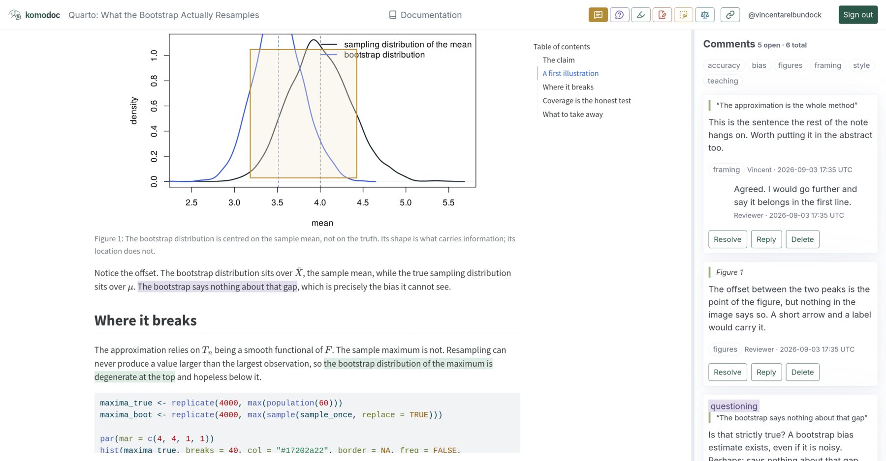

Publish an HTML or Markdown document, share a link to it, and collect
comments and highlights in real time.

- Highlight passages, suggest edits, and comment on figures
- Multiple people can annotate simultaneously, with live updates
- Publish documents from the CLI; review and manage them in the browser
- Trivial to deploy: one static binary, on your laptop or on a small server
- Free public sandbox for small, short-lived notebooks
- Allow anonymous comments or require GitHub authentication
- Export annotations as Markdown or W3C JSON-LD



## Your first document

There is nothing to write to begin with. The tutorial is a real LibrePaper
document, already published and already carrying a few comments, and it is
open to anyone:

**[Learn LibrePaper with Markdown](https://app.librepaper.org/docs/learn-librepaper-with-markdown-t678fbd47v)**

Drag across a sentence and a comment box opens where you released. That is the
whole of the idea; everything else in this manual is a detail of it.

The tutorial invites you to edit it, so edit it: change a sentence and watch
the preview keep up.

## The same document, in your own account

Signing in gives you your own private copy of that tutorial, and four more
beside it — the same walkthrough written in Typst, HTML, LaTeX and Quarto, so
you can read it in whichever source language you already work in. They arrive
once, when the account is made, and stay deleted if you remove them.

| Format | Tutorial |
| --- | --- |
| Markdown | [Learn LibrePaper with Markdown](https://app.librepaper.org/docs/learn-librepaper-with-markdown-t678fbd47v) |
| Typst | [Learn LibrePaper with Typst](https://app.librepaper.org/docs/learn-librepaper-with-typst-8fzxwcqcnc) |
| HTML | [Learn LibrePaper with HTML](https://app.librepaper.org/docs/learn-librepaper-with-html-8vqyakbbyb) |
| LaTeX | [Learn LibrePaper with LaTeX](https://app.librepaper.org/docs/learn-librepaper-with-latex-ua3e2x26cw) |
| Quarto | [Learn LibrePaper with Quarto](https://app.librepaper.org/docs/learn-librepaper-with-quarto-mgprkwz4m7) |

Those addresses do not change. A curated tutorial's suffix is derived from its
title rather than drawn at random, so re-seeding a deployment leaves these
links pointing at the same documents — which is safe only because a tutorial
is public on purpose. Every other document keeps an unguessable address. See
[the sandbox](sandbox.md) for what that means for your own work.

## Install

You do not need the CLI to read or comment on a document. You need it to
publish one from a project on your own machine.

```sh
curl -fsSL https://raw.githubusercontent.com/LibrePaper/librepaper/main/deploy/install.sh | sh
```

The installer supports Linux and macOS. Windows binaries are available on the
[releases page](https://github.com/LibrePaper/librepaper/releases).

Then [publish something of your own](../cli/publish.md).
