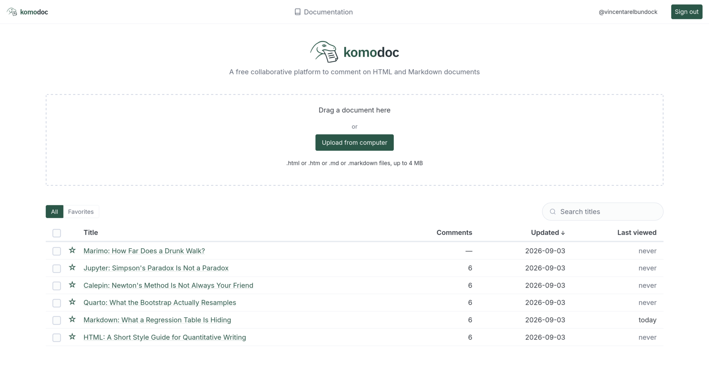

Publish an HTML or Markdown document, share a link to it, and collect
comments and highlights in real time.

- Highlight passages, suggest edits, and comment on figures
- Multiple people can annotate simultaneously, with live updates
- Publish documents from the CLI; review and manage them in the browser
- Trivial to deploy: one static binary, on your laptop or on a small server
- Free public sandbox for small, short-lived notebooks
- Allow anonymous comments or require GitHub authentication
- Export annotations as Markdown or W3C JSON-LD




## Install

```sh
curl -fsSL https://raw.githubusercontent.com/LibrePaper/librepaper/main/deploy/install.sh | sh
```

The installer supports Linux and macOS. Windows binaries are available on the
[releases page](https://github.com/LibrePaper/librepaper/releases).
